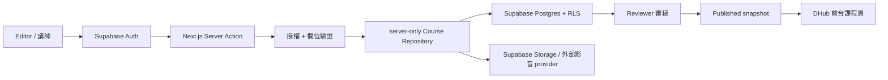

# DHub 線上課程上稿架構（Demo → 正式版）

## 目的與目前狀態

本文件說明 `/admin/courses` 上稿 Demo 與正式內容系統的界線，供前台課程頁、管理後台與 Supabase 整合時共同對齊。現階段可以操作列表、草稿／發佈意圖、伺服器欄位驗證、影音及封面 URL、基本課綱與即時預覽；**沒有登入、資料庫寫入、檔案上傳、審核通知或真正發佈行為**。

部署到團隊環境時需設定 `NEXT_PUBLIC_SITE_URL` 為正式網站 origin，供 canonical 與社群預覽圖片組出完整網址；未設定時僅以本機開發網址作 fallback。

目前 Demo 路由：

- `/admin/courses`：三筆固定示意資料，呈現列表與狀態資訊。
- `/admin/courses/new`：React 19 `useActionState` 表單與 Server Action 驗證。
- 送出成功固定顯示「Demo 驗證通過但尚未永久儲存」，不更新列表，也不呼叫快取重整。

## Demo／正式版邊界

| 能力 | 目前 Demo | 正式版目標 |
|---|---|---|
| 身分與權限 | `requireAdmin()` 回傳明確標記的示範身分 | Supabase Auth session + editor/reviewer/admin 授權 |
| 課程列表 | 程式碼內固定資料 | repository 只讀取使用者有權查看的資料 |
| 草稿／發佈 | 只代表不同驗證嚴格度 | 寫入草稿或啟動審稿流程，不能由一般 editor 直接公開 |
| 封面與 MP4 | 接受 URL | Supabase Storage 上傳、檔案掃描、metadata 與 signed URL |
| YouTube／Vimeo | 驗證網域並提供預覽 | 正規化 provider ID、檢查嵌入權限與授權紀錄 |
| 課綱 | 每行一個單元 | 可排序的章節／單元資料與個別影音 |
| 前台同步 | 無 | 只查詢 `published` 且已到發佈時間的版本 |
| 歷程 | 無 | revision、審核事件、操作者與時間完整留存 |

不要在 Demo Action 內暫時加記憶體陣列或寫檔模擬儲存。Cloudflare 多實例／Edge 執行時不保證同一份本機狀態，這類做法也容易讓團隊誤判資料已存在。

## 建議正式資料流



Server Action 應保持薄層：取得 session、呼叫 `requireAdmin`／`requireCoursePermission`、解析並驗證不可信任的 `FormData`，再交給 `server-only` repository。資料庫 client、service role key 與完整資料列不可進入 Client Component。正式寫入成功後，才依前台的快取策略呼叫 `revalidatePath` 或 tag revalidation。

建議 repository 介面先隔離實作：

```ts
type SaveCourseCommand = {
  courseId?: string;
  expectedVersion?: number;
  intent: "draft" | "submit_review";
  input: ValidatedCourseInput;
  actorId: string;
};

interface CourseRepository {
  listForEditor(actorId: string): Promise<CourseSummary[]>;
  getForEditor(courseId: string, actorId: string): Promise<CourseEditorData>;
  save(command: SaveCourseCommand): Promise<{ courseId: string; version: number }>;
}
```

`expectedVersion` 用於 optimistic concurrency control，避免兩位編輯者同時開啟頁面後互相覆蓋。寫入課程、章節、單元與 audit event 應在單一 transaction／Supabase RPC 中完成。

## 建議 Supabase 資料模型

名稱可在正式 migration 前調整，但關聯與權限邊界建議保留。

### 身分與角色

- `profiles`：`user_id`（對應 `auth.users`）、顯示名稱、頭像；不可讓使用者自行更新權限欄位。
- `workspace_memberships`：`user_id`、`workspace_id`、`role`（`editor`／`reviewer`／`admin`）、停用時間。若目前只有單一 DHub workspace，仍建議保留 membership 邊界，日後較容易擴充合作講師。
- `instructors`：講師公開名稱、簡介、頭像、聯絡用內部欄位、授權狀態。
- `course_instructors`：課程與講師多對多關聯、顯示順序、角色。

### 課程與課綱

- `courses`：`id`、`workspace_id`、唯一 `slug`、`status`、目前草稿版本、目前發佈版本、`published_at`、建立／更新者與時間。
- `course_revisions`：`course_id`、遞增 `version`、title、summary、description（可用結構化 JSON 或 MDX 字串）、category、level、cover asset、預估時數、建立者與時間。已發佈版本不可原地改寫。
- `course_sections`：`revision_id`、標題、說明、`position`。
- `course_lessons`：`section_id`、標題、摘要、`position`、預估／實際秒數、`media_asset_id`、是否試看、字幕資訊。
- `course_categories`：穩定 key、顯示名稱、排序、啟用狀態；避免把可變的中文名稱當永久識別值。
- `course_review_events`：課程、revision、`from_status`、`to_status`、留言、操作者、時間，作為不可覆寫的 audit trail。

若之後需要學習功能，再獨立加入 `enrollments`、`lesson_progress`、完成紀錄；不應讓學員資料與上稿 transaction 綁在一起。

### 學習群島與解鎖進度

前台 `/courses` 的「學習群島」目前是互動 Demo：四個大陸採固定策展順序，完成示範關卡後只在瀏覽器記憶體內解鎖下一站，重整即還原。`published`／`coming-soon` 是課程內容生命週期；`completed`／`current`／`available`／`locked` 則是個別學員狀態，正式版不可混用同一欄位。

建議正式版另外加入：

- `learning_paths`、`learning_path_nodes`：管理航線名稱、節點順序、課程、支線與前置節點，不依前台陣列順序推算。
- `enrollments`、`lesson_progress`、`course_completions`：記錄個別學員進度，完成狀態由伺服器依單元完成紀錄計算。
- 解鎖服務：以「前置節點皆完成」派生可用狀態；`coming-soon` 課程宜作為不阻塞主線的支線，並另外呈現內容可用性。
- 未登入者若保留體驗進度，可先存 local storage，登入後再由明確的 merge 規則寫入帳號；不要讓 client 傳來的 `completed` 直接成為可信紀錄。

正式 API／repository 應一次回傳課程可用性、學習狀態、完成百分比與續學網址，讓首屏航海卡和群島地圖共享同一份資料，避免進度顯示不一致。

### 媒體

- `media_assets`：`id`、workspace、kind（cover／video／caption）、provider、storage path 或外部 provider ID、原始檔名、MIME、bytes、width／height、duration、checksum、處理狀態、建立者與時間。
- 資料庫只存 Storage path／provider ID，不存短效 signed URL。
- 外部影音的原始 URL 可保留於內部 metadata，但前台使用經過正規化與 allowlist 驗證的 embed ID。

## Supabase Auth、RLS 與 Storage

1. 後台頁面與**每一個** Server Action 都重新取得 Supabase session；只在 layout 隱藏畫面不構成授權。
2. RLS 至少區分：匿名者只能讀有效的 published snapshot；editor 只能讀寫自己 workspace 的草稿；reviewer 可轉換審核狀態；admin 可管理成員與封存內容。
3. 建議用受保護的 membership table，或由伺服器管理的 `app_metadata` custom claims 判斷角色。不可相信表單傳來的 `role`、`workspace_id`、`owner_id`。
4. 可用 `security definer` helper function 集中 membership 判斷，但需固定 `search_path`、限制 execute 權限並納入 migration review。
5. Service role key 僅存在伺服器環境；一般上稿優先使用使用者 session，讓 RLS 仍然生效。

Storage 建議建立：

- `course-covers`：可公開讀取已發佈衍生圖；原圖可維持私有。限制 image MIME、檔案大小與 workspace 路徑，產生固定比例縮圖。
- `course-videos`：預設 private。上傳採 signed upload URL，播放採短效 signed URL 或串流服務；需驗證 MIME、大小、checksum，並規劃轉碼／惡意檔案掃描。
- `course-captions`：private，接受 VTT 等明確格式；字幕語系與影音單元建立關聯。

Storage policy 應檢查 bucket、路徑中的 workspace／asset ID 與 membership，不要只用「登入即可上傳」。刪除媒體前先檢查是否仍被任一 revision 引用。

## YouTube、Vimeo 與 MP4 策略

### YouTube

- 接受 `youtube.com/watch`、`youtu.be`、`embed`／`shorts` 格式後，轉成單一 video ID。
- 正式儲存前檢查影片是否允許嵌入；不公開／會員限定影片需要另外確認觀看身分流程。
- 建議使用 privacy-enhanced embed domain，仍需在隱私權與 Cookie 說明揭露第三方播放器。

### Vimeo

- 儲存 numeric video ID；若合作講師使用 domain-level privacy，需將 DHub 正式與 preview domain 加入允許清單。
- 私密影片可能需要 hash／token，不可在 log 或 client error 中外洩。

### MP4

- 小型示範可由 Supabase Storage 提供；長影音建議評估具轉碼、adaptive streaming、CDN 與觀看分析能力的專用影音服務。
- 確保 Range requests、正確 `Content-Type`、CORS、字幕、poster、行動網路大小與 Cloudflare／Storage 流量成本。
- 不接受由編輯者任意填寫的跨站 MP4 直接公開，正式版應改成受控 media asset。

三種來源都需要記錄內容權利與講師授權，並提供字幕／逐字稿欄位。網址格式正確不等於團隊擁有發布權。

## 建議審稿流程

```text
draft → in_review → changes_requested → in_review → approved → published
                                            ↘ scheduled → published
published → archived
```

- `editor`：建立與修改 draft、送審；不能直接把狀態改成 published。
- `reviewer`：退回修改或 approved，必須留下事件紀錄。
- `admin`：處理緊急下架、封存與角色管理。
- 發佈操作建立不可變的 published revision；之後修改從該版本複製出新 draft，避免前台在編輯途中變動。
- 發佈前檢查：必要欄位、slug 唯一、媒體可用、封面比例、至少一個可播放單元、字幕／授權狀態，以及預定時間。

## 與現有前台／MDX 的整合決策

專案慣例提到 `content/courses` 可使用 MDX，但後台上稿若以 Supabase 為主，應先決定唯一內容來源，避免資料庫與 Git 內的 MDX 雙向同步。建議：

- 課程 metadata、狀態、課綱與影音採 Supabase 作為 single source of truth。
- 長篇課程介紹可在 `course_revisions` 存 MDX 字串，再沿用既有安全的 MDX render pipeline；或改用結構化 rich-text JSON，但兩者擇一。
- 若仍需 Git 審查，可做「DB → MDX export」的單向發佈產物，不讓編輯者同時修改兩份來源。
- 前台先依 `CourseRepository` 的讀取 DTO 製作，Demo 可使用 fixture；正式串接時替換 repository，不讓 UI 依賴 Supabase row shape。

## 整合 next steps 與需要協助

1. 產品負責人確認課程是否免費／付費、是否需要登入、發佈是否必須審稿，以及合作講師可以操作到哪一層。
2. 內容與法務協助確認影片授權、下架流程、字幕與無障礙最低標準。
3. 設計負責人用 Figma 對齊後台表單、錯誤狀態、章節排序與行動版互動。
4. 後端負責人建立 Supabase migration、Auth role、RLS 測試矩陣、Storage policy 與 repository；部署前在 Cloudflare/OpenNext 環境驗證 Server Actions、檔案大小與 signed upload。
5. 前台課程負責人與後台共同定義 `CoursePublicDTO`，確認 slug、分類、講師、影音與課綱欄位命名。
6. 實作正式 create/edit/review actions、transaction、audit log、錯誤監控與 revalidation；接著補單元排序、上傳進度、離頁未儲存提醒。
7. 團隊選定測試框架後，補上 Server Action validation、RLS、repository concurrency、發布可見性與主要上稿流程測試。
